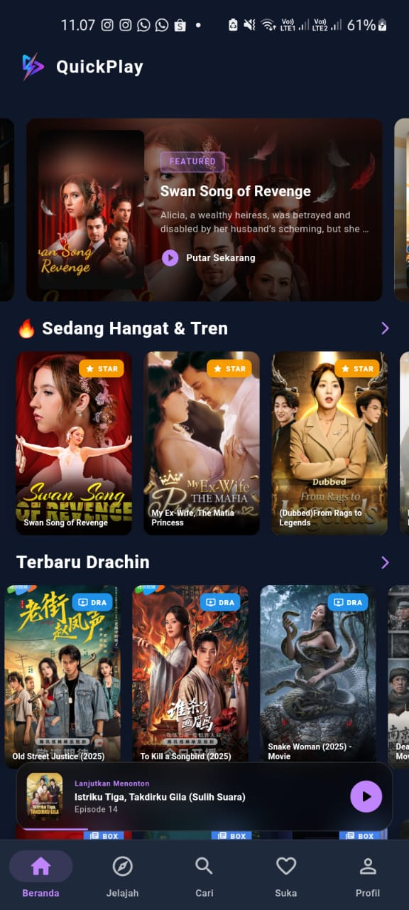
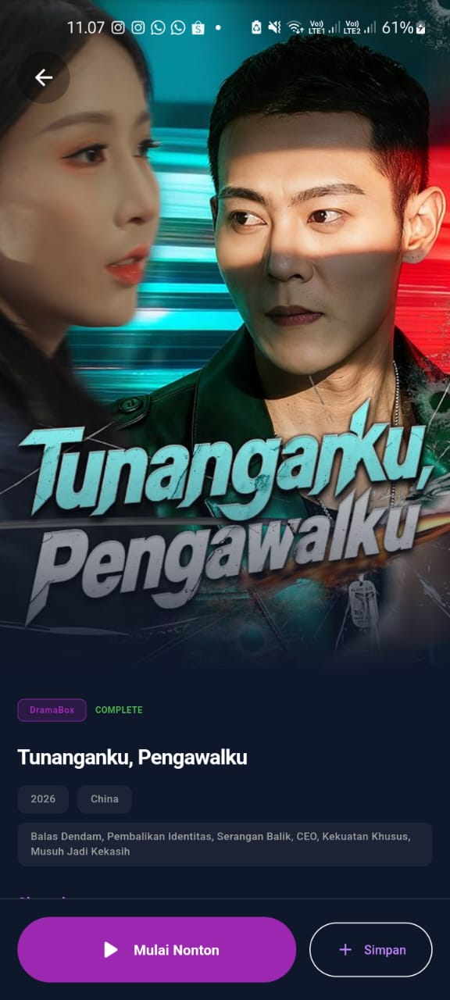
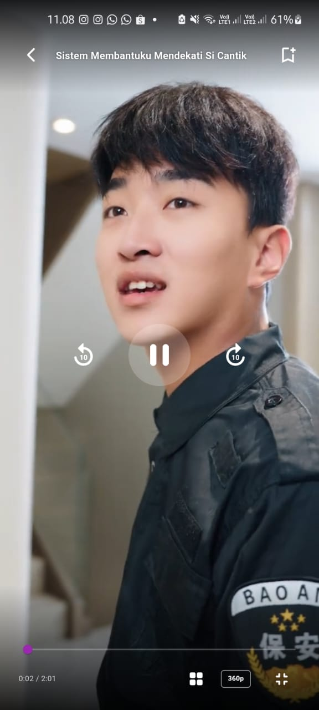

# QuickPlay - Modern Streaming App

[](https://github.com/irwanx/quickplay-download/releases)
[](https://flutter.dev)
[](https://nodejs.org/)
[](LICENSE)
[](https://github.com/irwanx/quickplay-download/releases)

> **Aplikasi streaming drama Asia all-in-one dengan tampilan modern, performa cepat, dan 18 provider konten terintegrasi.**

**QuickPlay** adalah aplikasi mobile (Android) yang dibangun dengan **Flutter**, mengonsumsi backend **api-drama** berbasis Node.js + Express yang mengagregasi konten dari **18 platform streaming** secara real-time. Semua data dinormalisasi ke format JSON yang seragam sebelum ditampilkan di aplikasi.

---

## Architecture

```
┌─────────────────────────────────────────────────────────────┐
│                    Android App (Flutter)                     │
│  ┌──────────┐  ┌──────────┐  ┌───────────┐  ┌──────────┐  │
│  │   Home   │  │  Search  │  │  History  │  │  My List │  │
│  └──────────┘  └──────────┘  └───────────┘  └──────────┘  │
│         ↓ HMAC-SHA256 signed requests (X-Signature)         │
└─────────────────────────────────────────────────────────────┘
                           ↓
┌─────────────────────────────────────────────────────────────┐
│              api-drama (Node.js + Express)                   │
│                                                             │
│  GET /api/v2/home      GET /api/v2/detail                   │
│  GET /api/v2/search    GET /api/v2/video                    │
│  GET /api/v2/discover  GET /api/v2/banner                   │
│                                                             │
│  ┌─────────────────────────────────────────────┐           │
│  │  3-Layer Cache                               │           │
│  │  Redis (30m-1h) → Live Scrape → MySQL (5m)  │           │
│  └─────────────────────────────────────────────┘           │
│                                                             │
│  Proxy: /api/proxy/image  /api/proxy/stream  /api/proxy/subtitle │
└─────────────────────────────────────────────────────────────┘
                           ↓
   18 Streaming Platforms (scrape real-time HTML/JSON)
```

### Frontend — Flutter

- **State management:** Reactive service pattern menggunakan Dart Streams + `setState`
- **Video player:** `media_kit` (cross-platform, mendukung HLS m3u8 dan MP4)
- **Auth:** HMAC-SHA256 (`crypto` package) matching backend signature scheme
- **Storage lokal:** `shared_preferences` untuk history, favorites, dan language preference
- **Search:** Progressive/streaming results — hasil per platform muncul seiring datanya tiba

### Backend — api-drama (Node.js)

- **Stack:** Express 5, MySQL (Sequelize ORM), Redis (3-layer caching), node-cron
- **Scraping:** Axios + Got + Cheerio; per-platform handler di `lib/v2/{home|detail|video|search|discover}/`
- **Proxy:** Image (HEIC→JPEG), M3U8 stream (URL rewriting + Range header), Subtitle (SRT→WebVTT)
- **Auth:** HMAC-SHA256 — `X-Signature: HMAC(secret, "METHOD:PATH:TIMESTAMP")`
- **Cron:** Setiap 2 jam purge Redis keys `v2_*` + truncate MySQL Content/Episode/VideoStream

---

## 18 Provider Terintegrasi

| # | Platform | Slug | # | Platform | Slug |
|---|----------|------|---|----------|------|
| 1 | **ReelShort** | `reelshort` | 10 | **SnackShort** | `snackshort` |
| 2 | **DramaBox** | `dramabox` | 11 | **FunDrama** | `fundrama` |
| 3 | **ShortMax** | `shortmax` | 12 | **StarShort** | `starshort` |
| 4 | **Melolo** | `melolo` | 13 | **FlexTV** | `flextv` |
| 5 | **NetShort** | `netshort` | 14 | **DramaRush** | `dramarush` |
| 6 | **MeloShort** | `meloshort` | 15 | **RapidTV** | `rapidtv` |
| 7 | **FlickReels** | `flickreels` | 16 | **DramaPops** | `dramapops` |
| 8 | **FreeReels** | `freereels` | 17 | **GoodShort** | `goodshort` |
| 9 | **DramaWave** | `dramawave` | 18 | **Reelife** | `reelife` |

---

## Fitur Unggulan

### Multi-Language Content
Mendukung konten dalam **3 bahasa**: Indonesia (`id`), Inggris (`en`), dan Arab (`ar`). Setiap platform memiliki kode bahasa yang berbeda-beda — backend menangani pemetaan ini secara otomatis.

### Smart Video Player
- **HLS (m3u8) & MP4** diputar via `media_kit`
- **Subtitle WebVTT** — di-proxy dan di-parse secara native; backend auto-convert SRT→WebVTT
- **Quality selection** — 720p, 1080p, atau auto sesuai koneksi
- **Persistent fit settings** — mode layar diingat antar episode
- **Auto-play next** — episode berikutnya diputar otomatis

### Progressive Search
Pencarian ke **semua 18 provider secara paralel** — hasil muncul satu per satu seiring platform merespons, bukan menunggu semua selesai.

### Watch History & My List
- Progress per-episode tersimpan lokal (SharedPreferences)
- **History dock** di halaman profil menampilkan drama terakhir ditonton
- **My List** — bookmark drama favorit dengan reactive update via Dart Streams
- Swipe-to-delete dari history

### UI Premium
- **Material Design 3** dengan tema Light/Dark (system-aware)
- **Skeleton loading** via shimmer — tidak ada loading spinner biasa
- **Banner carousel** untuk featured content dari DramaBox
- **Glassmorphism** pada elemen navigasi
- **Responsive** — mobile, tablet, web, desktop didukung

### Community & Feedback
- Papan komunitas untuk pesan antar pengguna
- Form feedback dengan lampiran gambar (max 2GB via multer)
- Riwayat feedback per pengguna

---

## Screenshots

|                  Home & Trending                  |                    Detail Series                    |                    Video Player                    |
| :-----------------------------------------------: | :-------------------------------------------------: | :------------------------------------------------: |
|  |  |  |
|                _Tampilan Beranda_                 |               _Halaman Detail & Cast_               |                 _Streaming Player_                 |

---

## Download & Install

### Situs Resmi

👉 **[https://quickplay.my.id/landing](https://quickplay.my.id/landing)**

### GitHub Releases (Manual)

1. Buka halaman **[Releases](https://github.com/irwanx/quickplay-download/releases)**
2. Pilih versi terbaru (Latest Release)
3. Di bagian **Assets**, unduh file `.apk` (contoh: `QuickPlay-v1.x.x.apk`)
4. Install — izinkan **"Unknown Sources"** jika diminta

---

## Legal Disclaimer & License

**QuickPlay** dibangun untuk **tujuan edukasi** sebagai demonstrasi pengembangan aplikasi mobile dengan Flutter dan backend scraper dengan Node.js.

- **Konten:** Pengembang tidak menghosting, menyimpan, atau mendistribusikan media apapun. Aplikasi ini bertindak sebagai client-side interface yang mengambil konten yang tersedia secara publik di internet.
- **Tanggung Jawab:** Pengguna bertanggung jawab penuh untuk mematuhi hukum setempat terkait streaming konten.
- **Hak Cipta:** Semua konten media, gambar, dan deskripsi adalah kekayaan intelektual dari pemiliknya masing-masing.

Proyek ini dilisensikan di bawah **MIT License** — lihat file [LICENSE](LICENSE) untuk detail.

---

<center>Built with ❤️ by <b>Irwan (dobda.id)</b></center>
