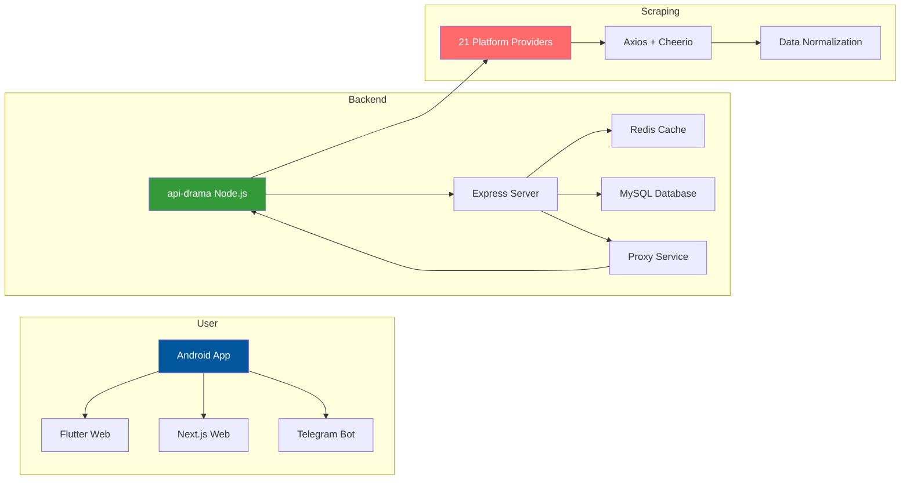
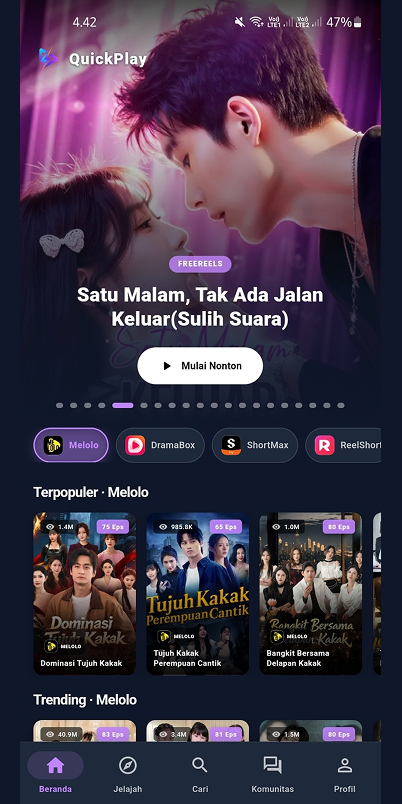
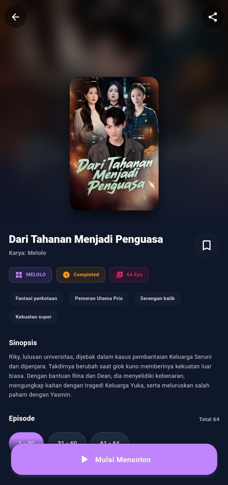
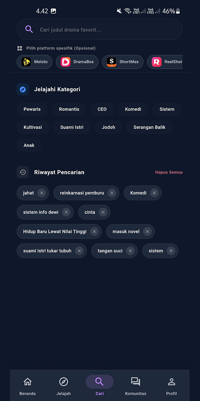
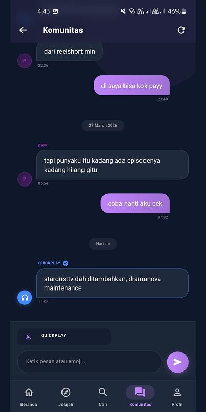

# 🎬 QuickPlay - Modern Streaming App

> **Aplikasi streaming drama Asia all-in-one dengan tampilan modern, performa cepat, dan 21 provider konten dari seluruh dunia.**

---

## 🔄 Cara Kerja Sistem

---

## ✨ Demo

| Platform     | Link                                            |
| ------------ | ----------------------------------------------- |
| Next.js Web  | [m.quickplay.my.id](https://m.quickplay.my.id)  |
| Flutter Web  | [quickplay.my.id](https://quickplay.my.id)      |
| Telegram Bot | [quickplaystrbot](https://t.me/quickplaystrbot) |

---

## 21 Provider Terintegrasi

| #   | Platform       | Slug         | Logo                                                | #   | Platform       | Slug         | Logo                                                |
| --- | -------------- | ------------ | --------------------------------------------------- | --- | -------------- | ------------ | --------------------------------------------------- |
| 1   | **Melolo**     | `melolo`     |      | 12  | **StarShort**  | `starshort`  |   |
| 2   | **DramaBox**   | `dramabox`   |    | 13  | **FlexTV**     | `flextv`     |      |
| 3   | **ShortMax**   | `shortmax`   |    | 14  | **DramaRush**  | `dramarush`  |   |
| 4   | **ReelShort**  | `reelshort`  |   | 15  | **RapidTV**    | `rapidtv`    |     |
| 5   | **NetShort**   | `netshort`   |    | 16  | **Dramapops**  | `dramapops`  |   |
| 6   | **MeloShort**  | `meloshort`  |   | 17  | **GoodShort**  | `goodshort`  |   |
| 7   | **FlickReels** | `flickreels` |  | 18  | **Reelife**    | `reelife`    |     |
| 8   | **FreeReels**  | `freereels`  |   | 19  | **DramaNova**  | `dramanova`  |   |
| 9   | **DramaWave**  | `dramawave`  |   | 20  | **StardustTV** | `stardusttv` |  |
| 10  | **SnackShort** | `snackshort` |  | 21  | **DramaBite**  | `dramabite`  |   |
| 11  | **FunDrama**   | `fundrama`   |    |     |                |              |                                                     |

## 13 Bahasa Dukungan

| #   | Bahasa         | Kode | Flag | #   | Bahasa         | Kode | Flag |
| --- | -------------- | ---- | ---- | --- | -------------- | ---- | ---- |
| 1   | **Indonesian** | `id` | 🇮🇩    | 8   | **Spanish**    | `es` | 🇪🇸    |
| 2   | **English**    | `en` | 🇬🇧    | 9   | **Vietnamese** | `vi` | 🇻🇳    |
| 3   | **Japanese**   | `ja` | 🇯🇵    | 10  | **German**     | `de` | 🇩🇪    |
| 4   | **Korean**     | `ko` | 🇰🇷    | 11  | **French**     | `fr` | 🇫🇷    |
| 5   | **Thai**       | `th` | 🇹🇭    | 12  | **Italian**    | `it` | 🇮🇹    |
| 6   | **Arabic**     | `ar` | 🇸🇦    | 13  | **Turkish**    | `tr` | 🇹🇷    |
| 7   | **Portuguese** | `pt` | 🇧🇷    |     |                |      |      |

---

## 🚀 Fitur Unggulan

### Multi-Language Content
Mendukung **13 bahasa** dari seluruh dunia.

### Smart Video Player
- HLS (m3u8) & MP4 via `media_kit`
- Subtitle WebVTT (auto-convert SRT→WebVTT)
- Quality selection (720p, 1080p, auto)
- Persistent fit settings
- Auto-play next episode

### Progressive Search
Pencarian ke **semua 21 provider secara paralel** — hasil muncul satu per satu.

### Watch History & My List
- Progress per-episode tersimpan lokal
- History dock di profil
- My List — bookmark favorit
- Swipe-to-delete

### UI Premium
- Material Design 3 + tema Light/Dark
- Skeleton loading via shimmer
- Banner carousel featured content
- Glassmorphism navigasi
- Responsive — mobile, tablet, web, desktop

### Community & Feedback
- Papan komunitas antar pengguna
- Form feedback dengan lampiran gambar

---

## 📱 Screenshots

### Utama

|                       Home                       |                       Detail                       |                       Video                       |
| :----------------------------------------------: | :------------------------------------------------: | :-----------------------------------------------: |
|  |  |  |
|                _Tampilan Beranda_                |                  _Halaman Detail_                  |                _Player Streaming_                 |

### Navigasi

|                       Search                       |                       Discover                       |                     My List                      |
| :------------------------------------------------: | :--------------------------------------------------: | :----------------------------------------------: |
|  |  |  |
|                 _Pencarian Cepat_                  |                  _Jelajahi Konten_                   |                 _Drama Favorit_                  |

### Profil & Pengaturan

|                       Profile                       |                      Community                       |
| :-------------------------------------------------: | :--------------------------------------------------: |
|  |  |
|                _Profil & Pengaturan_                |                 _Komunitas Pengguna_                 |

### Settings

|                       Settings 1                       |                       Settings 2                       |                       Settings 3                       |
| :----------------------------------------------------: | :----------------------------------------------------: | :----------------------------------------------------: |
|  |  |  |
|                  _Pengaturan - Tema_                   |                 _Pengaturan - Bahasa_                  |                _Pengaturan - Pemutaran_                |

---

## ⬇️ Download & Install

### Situs Resmi
👉 **[https://quickplay.my.id/landing](https://quickplay.my.id/landing)**

### GitHub Releases
1. Buka **[Releases](https://github.com/irwanx/quickplay-download/releases)**
2. Pilih versi terbaru
3. Unduh `.apk` (contoh: `QuickPlay-v1.1.8.apk`)
4. Install — izinkan **"Unknown Sources"**

---

## ⚠️ Legal Disclaimer & DMCA Policy

**QuickPlay** adalah proyek open source untuk **tujuan edukasi** dalam pengembangan aplikasi mobile dengan Flutter dan backend Node.js.

### Konten
- Pengembang **tidak menghosting, menyimpan, atau mendistribusikan** media apapun
- Aplikasi ini hanya sebagai interface/client yang mengambil konten yang tersedia secara publik di internet
- Semua konten media, gambar, dan deskripsi adalah milik pemilik masing-masing
- Data dikontrol otomatis oleh user, server hanya proxy (tidak menyimpan media)

### Tanggung Jawab
- Pengguna bertanggung jawab penuh untuk mematuhi hukum setempat terkait streaming/pengunduhan konten
- Penggunaan untuk tujuan Edukasi/Belajar - Dilarang untuk memperjualbelikan proyek ini

### DMCA Policy
- Kami menghormati hak kekayaan intelektual dan DMCA
- Jika Anda menemukan pelanggaran hak cipta, silakan hubungi kami langsung
- Kami akan segera menindaklanjuti permintaan removal yang valid

### Keamanan Data
- Server melakukan **pembersihan data otomatis setiap 3 jam** via cron job
- Redis cache di-flush secara berkala, tidak ada media yang disimpan permanen
- MySQL database di-truncate secara periodik

### Lisensi
Proyek ini dilisensikan di bawah **MIT License** — lihat file [LICENSE](LICENSE).

---

Built with ☕ by **Irwan (dobda.id)**

