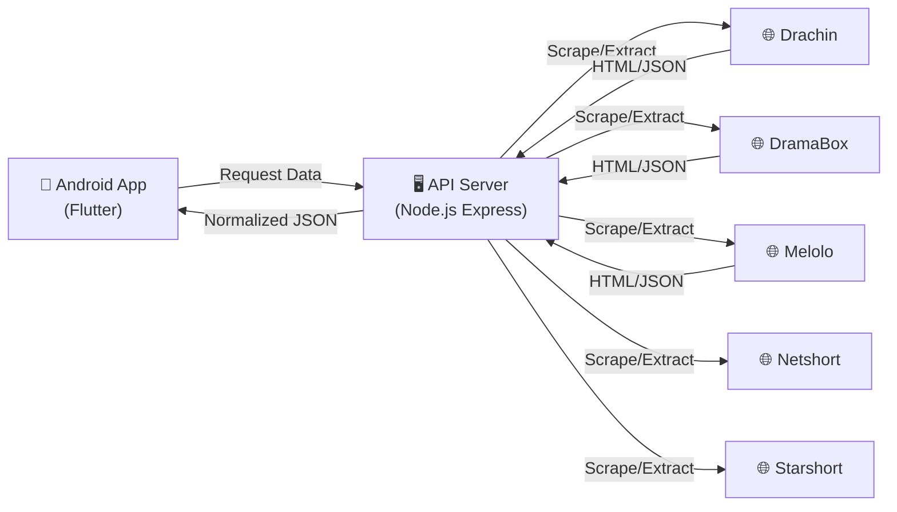

# 🎬 QuickPlay - Modern Streaming App

> **Aplikasi streaming video all-in-one dengan tampilan modern, performa cepat, dan database konten yang luas.**

**QuickPlay** adalah aplikasi mobile (Android) yang dikembangkan menggunakan Flutter. Aplikasi ini dirancang untuk memberikan pengalaman menonton drama Asia (Drachin, dll) dengan antarmuka yang bersih, modern, dan mudah digunakan.

---

## 🏗️ Arsitektur Sistem

Aplikasi ini menggunakan arsitektur **Client-Server** yang memisahkan antara tampilan antarmuka (Frontend) dan logika pengambilan data (Backend).

### 📱 Frontend (Flutter)

Aplikasi Android yang dibangun dengan Flutter. Bertanggung jawab untuk menampilkan UI yang interaktif, memutar video, dan menangani interaksi pengguna. Menggunakan **Dio/HTTP** untuk berkomunikasi dengan API Server custom kami.

### 🖥️ Backend (Node.js)

Server perantara (Custom Scraper) yang dibangun dengan **Node.js** dan **Express**. Bertugas untuk:

1.  **Request & Parsing:** Mengambil data dari website sumber (Drachin, dll) secara _real-time_.
2.  **Normalization:** Mengubah format data yang berantakan dari berbagai sumber menjadi format JSON standar yang siap digunakan oleh aplikasi.
3.  **Proxying:** Menangani _bypass_ proteksi gambar (referer check) agar poster bisa muncul di aplikasi.
4.  **Extraction:** Mengekstrak link video m3u8/mp4 dari halaman sumber.

---

## ✨ Fitur Unggulan

### 🌍 Multi-Provider (Sumber Konten)

Aplikasi ini menggabungkan konten dari berbagai sumber populer menjadi satu tempat:

- **Drachin:** Gudang drama China (Mandarin) dengan subtitle Indonesia.
- **DramaBox:** Koleksi drama pendek vertikal yang sedang tren.
- **Melolo:** Sumber drama Asia variatif.
- **Netshort & Starshort:** Platform video pendek serial yang cepat dan ringkas.

### 🎥 Pemutar Video Cerdas

- **Persistent Fit Settings:** Aplikasi mengingat preferensi tampilan Anda. Jika Anda mengubah mode layar ke **Full Screen (Cover)**, video episode selanjutnya akan otomatis mengikuti tanpa perlu diatur ulang.
- **Auto-Play Next:** Otomatis memutar episode selanjutnya secara mulus (_seamless_).
- **Support Multi-Format:** Mendukung pemutaran HLS (m3u8) dan MP4 standar secara natif menggunakan `media_kit`.

### 🔍 Pencarian & Navigasi

- **Smart Grouping:** Hasil pencarian dikelompokkan berdasarkan Judul Series, bukan membanjiri hasil dengan setiap episode secara terpisah.
- **Aggregated Search:** Satu kata kunci pencarian akan mencari ke SEMUA provider sekaligus (Parallel Execution) untuk hasil yang komprehensif.

### 🎨 User Interface (UI) Premium

- **Glassmorphism:** Sentuhan modern dengan efek _blur/transparan_ pada elemen navigasi.
- **Dynamic Floating Header:** Header yang responsif terhadap scroll pengguna.
- **Skeleton Loading:** Loading state yang elegan menggunakan animasi skeleton, bukan loading spinner biasa.

---

## 📱 Screenshots

|                        Home & Trending                        |                           Detail Series                           |                           Video Player                           |
| :-----------------------------------------------------------: | :---------------------------------------------------------------: | :--------------------------------------------------------------: |
|  |  |  |
|                      _Tampilan Beranda_                       |                      _Halaman Detail & Cast_                      |                        _Streaming Player_                        |

_(Note: Screenshot di atas adalah placeholder. Tampilan asli mungkin berbeda pada versi terbaru)_

---

## 📥 Cara Download & Install

Anda dapat mengunduh aplikasi **QuickPlay** melalui situs resmi atau GitHub:

### 🌐 Situs Resmi (Mudah & Cepat)

Kunjungi situs resmi kami untuk mendapatkan versi terbaru dengan mudah:
👉 **[https://quickplay.dobda.id](https://quickplay.dobda.id)**

### 🐙 GitHub Releases (Manual)

Jika Anda ingin melihat _changelog_ lengkap atau versi lama:

1.  Buka halaman **[Releases Terbaru](https://github.com/irwanx/quickplay-download/releases)**.
2.  Pilih versi paling atas (Latest Release).
3.  Pada bagian **Assets**, klik file apk (contoh: `QuickPlay-v1.x.x.apk`) untuk mulai mengunduh.

### 📦 Cara Install (Sideload)

1.  Buka file APK yang sudah diunduh.
2.  Jika muncul peringatan keamanan, izinkan instalasi dari **"Unknown Sources"** (Sumber Tidak Dikenal) di pengaturan HP Anda.
3.  Tunggu proses instalasi selesai dan aplikasi siap digunakan!

---

## ⚖️ Legal Disclaimer & License

**QuickPlay** dibangun untuk **tujuan edukasi** sebagai demonstrasi kemampuan pengembangan aplikasi mobile dengan Flutter dan scraper backend dengan Node.js.

1.  **Konten:** Pengembang QuickPlay tidak menghosting, menyediakan, mengarsipkan, menyimpan, atau mendistribusikan media apa pun di server kami. Aplikasi ini bertindak murni sebagai antarmuka sisi-klien (_client-side scraper_) yang merayapi konten yang tersedia secara publik di internet.
2.  **Tanggung Jawab:** Pengembang tidak bertanggung jawab atas cara pengguna menggunakan aplikasi ini. Pengguna bertanggung jawab penuh untuk mematuhi hukum setempat terkait streaming konten.
3.  **Hak Cipta:** Semua konten media, gambar, dan deskripsi yang ditampilkan dalam aplikasi adalah kekayaan intelektual dari pemiliknya masing-masing.

Proyek ini dilisensikan di bawah **MIT License**. Lihat file [LICENSE](LICENSE) untuk detail selengkapnya.

---

Built with 💙 by <b>Irwanto (dobda.id)</b>

